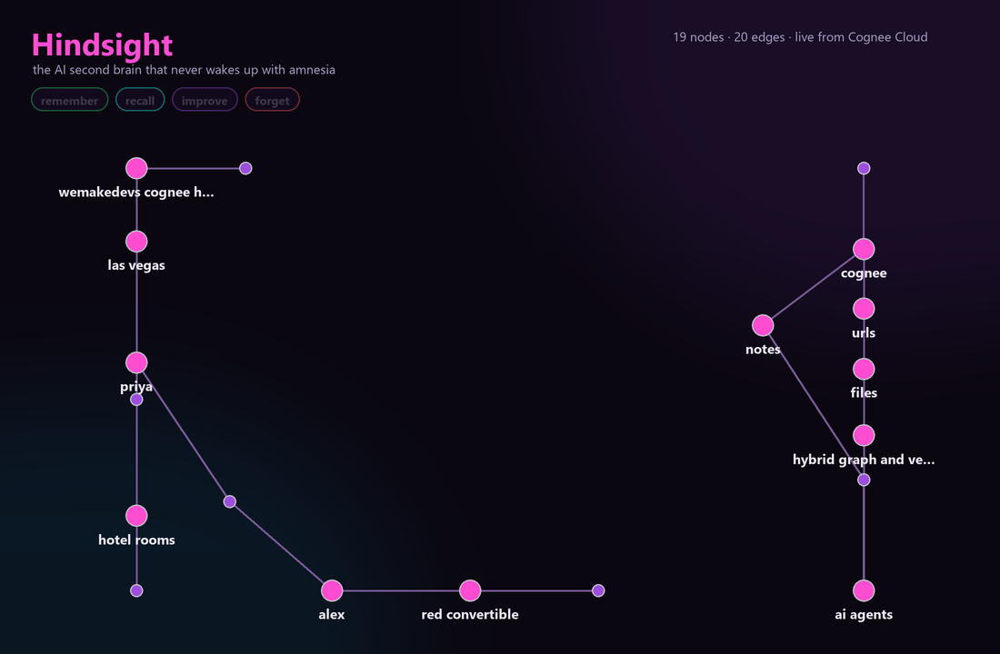
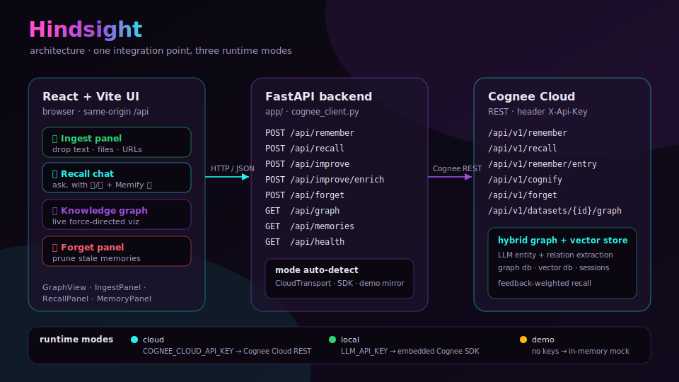

<div align="center">

# 🧠 Hindsight

### the AI second brain that never wakes up with amnesia

*Your AI woke up in Vegas with no memory of last night. Hindsight is the one that remembers.*

[](https://github.com/ROHITCRAFTSYT/hindsight/actions/workflows/ci.yml)
[](LICENSE)


Built for **"The Hangover Part AI: Where's My Context?"** — the [Cognee](https://www.cognee.ai) × [WeMakeDevs](https://www.wemakedevs.org/hackathons/cognee) hackathon.


</div>

---

Hindsight is a **second-brain copilot** powered by Cognee's memory layer. Throw in your notes, files,
and URLs — it ingests them into a **hybrid graph + vector memory**, lets you **ask anything in natural
language**, **learns from your 👍/👎 feedback**, and **forgets** what's stale. And it renders the living
**knowledge graph** it builds in real time, so you can literally *see* your AI remembering.

It exercises the **entire Cognee memory lifecycle** — which is exactly what the hackathon asks for:

| Lifecycle | Cognee Cloud endpoint | In Hindsight |
|-----------|-----------------------|--------------|
| 🟢 **Remember** | `POST /api/v1/remember` | Ingest panel — drop in text, files, or URLs |
| 🔵 **Recall**   | `POST /api/v1/recall`   | Ask-anything chat that reasons over the graph |
| 🟣 **Improve**  | `POST /api/v1/remember/entry` (👍/👎 typed feedback) · `POST /api/v1/cognify` (Memify ✨) | Vote to re-weight memory; Memify enriches the whole graph |
| 🔴 **Forget**   | `POST /api/v1/forget`   | Prune a memory by `data_id`, or wipe everything |

> In **Cognee Cloud** mode, Hindsight calls the Cognee Cloud REST API directly (`X-Api-Key` auth) and
> pulls the live graph from `GET /api/v1/datasets/{id}/graph`. In **self-hosted** mode it drives the
> embedded Cognee Python SDK instead. Same UI, one env var apart.

---

## 🕸️ The knowledge graph is the point

Most memory demos are a black box. Hindsight makes memory **visible**: every fact you remember becomes
entities and relationships you can see, query, and prune. Below is a **real graph** built live on Cognee
Cloud from three sentences about a Vegas trip — `priya → booked → hotel rooms`, `alex → rented → red
convertible`, all tied to the `wemakedevs cognee hackathon`.

<div align="center">

</div>

---

## ✨ Why it stands out

- **Effective use of Cognee's memory APIs** — all four lifecycle ops are first-class, user-triggered UI actions, not buried calls. Verified end-to-end against a **live Cognee Cloud tenant**.
- **Killer demo** — a force-directed knowledge graph that **grows as you remember and shrinks as you forget**, in real time.
- **Real impact** — a genuinely useful personal-knowledge tool; the pattern generalizes to any agent that needs durable memory.
- **Production-minded** — Dockerized, CI-gated (lint + tests + build), three runtime modes, graceful cold-start handling.
- **Runs anywhere** — Cognee Cloud, fully self-hosted, or a **zero-key demo mode** so judges can click around in seconds.

---

## 🏗️ Architecture

<div align="center">

</div>

- **`backend/`** — FastAPI service. [`cognee_client.py`](backend/app/cognee_client.py) is the single Cognee integration point: a `CloudTransport` (httpx, `X-Api-Key`) for Cognee Cloud, the embedded SDK for self-hosted, and an in-memory graph that powers demo mode + an optimistic UI mirror. Auto-detects the mode and handles Cloud cold-starts with retries.
- **`frontend/`** — Vite + React app: ingest panel, recall chat, a live force-directed graph canvas, and memory management, in a cohesive neon "Vegas" theme.

---

## 🚀 Quickstart

### Option A — Docker (one command)

```bash
cp .env.example backend/.env      # add your Cognee Cloud key, or leave blank for demo mode
docker compose up --build
```

Open **http://localhost:8080**. The frontend (nginx) serves the built app and proxies `/api` to the backend.

### Option B — Local dev

```bash
# 1) Backend  (Python 3.10+)
cd backend
python -m venv .venv
source .venv/bin/activate          # Windows: .venv\Scripts\activate
pip install -r requirements.txt
cp ../.env.example .env             # optional — leave blank for demo mode
uvicorn app.main:app --reload --port 8000    # docs at http://localhost:8000/docs

# 2) Frontend  (Node 18+)  — in a second terminal
cd frontend
npm install
npm run dev                         # http://localhost:5173
```

No keys? Hindsight auto-runs in **demo mode** (a zero-dependency in-memory mock), so the whole UI works offline.

---

## 🔑 Configuration

Three modes, selected automatically from `backend/.env` (see [`.env.example`](.env.example)):

**A) Cognee Cloud — the hackathon Cloud track (recommended)**
```env
COGNEE_CLOUD_API_KEY=your_cloud_key
COGNEE_SERVICE_URL=https://<your-tenant>.cognee.ai   # the host shown in your dashboard
```
Sign up at [platform.cognee.ai](https://platform.cognee.ai) and redeem the free Developer plan with code **`COGNEE-35`**.

**B) Self-hosted / open source** — embedded Cognee SDK; any LLM provider (Groq, OpenAI, …):
```env
LLM_API_KEY=gsk_...
LLM_PROVIDER=groq
LLM_MODEL=groq/llama-3.3-70b-versatile
```
> Self-hosted mode also needs the SDK: `pip install "cognee[groq]"`.

**C) Demo mode** — zero keys:
```env
DEMO_MODE=true
```

---

## 🧩 API surface

| Method | Endpoint | Lifecycle | Body |
|--------|----------|-----------|------|
| `POST` | `/api/remember` | remember | `{ "data": "...", "dataset": "main" }` |
| `POST` | `/api/recall` | recall | `{ "query": "...", "search_type"?: "GRAPH_COMPLETION", "top_k"?: 10 }` |
| `POST` | `/api/improve` | improve | `{ "query": "...", "answer": "...", "vote": "up"\|"down", "note"?: "..." }` |
| `POST` | `/api/improve/enrich` | improve | `{ "dataset"?: "main" }` — the Memify ✨ pass |
| `POST` | `/api/forget` | forget | `{ "node_id"?: "<data_id>", "dataset"?: "...", "all"?: false }` |
| `GET`  | `/api/memories` | — | `{ memories: [{ id, label }] }` — the Forget panel |
| `GET`  | `/api/graph` | — | `{ nodes, edges }` for the live visualization |
| `GET`  | `/api/health` | — | mode + cloud connectivity |

Interactive docs (Swagger) at `/docs` when the backend is running.

---

## 🧪 Tests & CI

```bash
cd backend
DEMO_MODE=true python -m pytest      # full lifecycle smoke tests, no keys needed
ruff check app tests                 # lint
```

[GitHub Actions](.github/workflows/ci.yml) runs backend lint + tests and a frontend build on every push. See [`CONTRIBUTING.md`](CONTRIBUTING.md) for the dev workflow.

---

## 📦 Repo layout

```
hindsight/
├── backend/
│   ├── app/
│   │   ├── main.py           # FastAPI routes
│   │   ├── cognee_client.py  # Cognee integration (cloud REST · SDK · demo)
│   │   ├── models.py         # Pydantic request/response models
│   │   └── seed.py           # demo data loader
│   ├── tests/                # pytest lifecycle smoke tests
│   ├── Dockerfile
│   └── requirements.txt
├── frontend/
│   ├── src/
│   │   ├── App.jsx · api.js
│   │   └── components/       # GraphView · RecallPanel · IngestPanel · MemoryPanel
│   ├── Dockerfile · nginx.conf
│   └── package.json
├── docs/
│   ├── DEMO.md               # 2-minute demo script
│   ├── BLOG.md · SOCIAL.md   # Best Blog + Social Buzz tracks
│   └── assets/               # diagram, graph, demo GIF
├── docker-compose.yml
├── .github/workflows/ci.yml
└── LICENSE                   # MIT (Open Source track)
```

---

## 🏆 Hackathon tracks

- [x] **Best Use of Cognee Cloud** — talks to the Cognee Cloud REST API directly; all four lifecycle ops verified live.
- [x] **Best Use of Open Source** — MIT licensed; runs fully self-hosted.
- [x] Live knowledge-graph visualization for the demo ([`docs/DEMO.md`](docs/DEMO.md)).
- [x] **Best Blog** — [`docs/BLOG.md`](docs/BLOG.md).
- [x] **Social Buzz** — [`docs/SOCIAL.md`](docs/SOCIAL.md).

---

## License

MIT — see [LICENSE](LICENSE). Built with [Cognee](https://www.cognee.ai). 🧠✨
